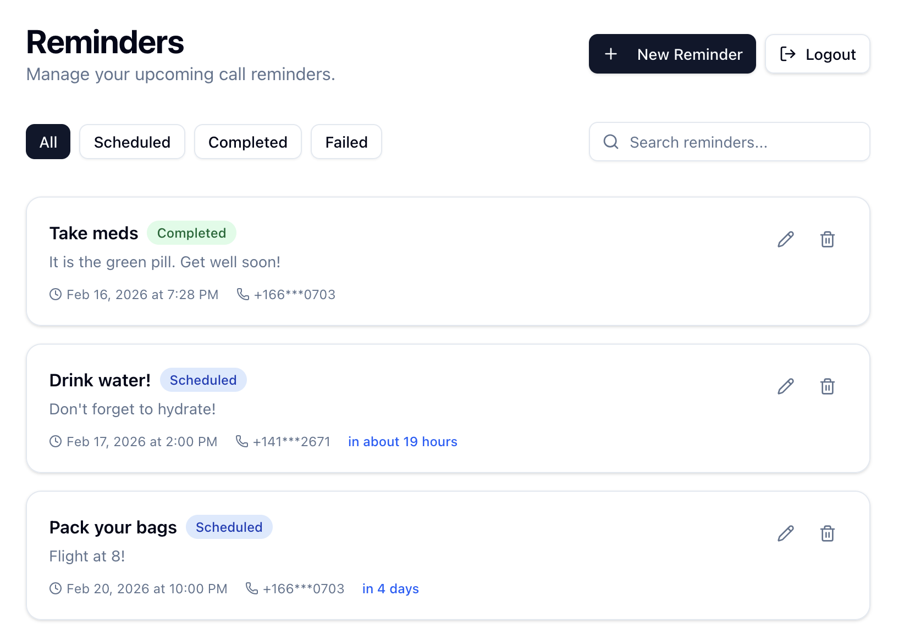

# Call Me Reminder 📞

A full-stack reminder application that automatically triggers phone calls to users at scheduled times. Built for the Senior Frontend Engineer take-home challenge.

 

## ✨ Features

- **🔐 Authentication:** Simple password-based authentication for development (default: `dev123`)
- **Smart Scheduling:** Create reminders with date, time, and timezone awareness.
- **Automated Calls:** Backend scheduler triggers real voice calls via Vapi.ai when reminders are due.
- **Live Dashboard:** Real-time status updates (Scheduled → Completed/Failed).
- **Production UI:** Built with Next.js, Tailwind, and shadcn/ui.
- **Robust Validation:** Zod schemas for forms and API payloads.

## 🛠 Tech Stack

- **Frontend:** Next.js 14 (App Router), TypeScript, React Query, Tailwind CSS, shadcn/ui, Hook Form.
- **Backend:** FastAPI (Python), APScheduler, SQLite, SQLAlchemy, Pydantic.
- **Infrastructure:** Vapi.ai (Voice AI), Twilio (Telephony via Vapi).

## 🚀 Getting Started

### 1. Prerequisites
- Node.js 18+
- Python 3.9+
- Vapi.ai Account (Public & Private Keys + Phone Number ID)

### 2. Backend Setup

```bash
cd backend
python -m venv venv
source venv/bin/activate  # Windows: venv\Scripts\activate
pip install -r requirements.txt

# Create .env file
cp .env.example .env
# Add your Vapi keys in .env
```

Start the server:
```bash
uvicorn app.main:app --reload
```
*Server runs at http://localhost:8000*

### 3. Frontend Setup

```bash
cd frontend
npm install

# Create .env.local
echo "NEXT_PUBLIC_API_URL=http://localhost:8000" > .env.local
```

Start the UI:
```bash
npm run dev
```
*App runs at http://localhost:3000*

## 🧪 How to Test the Call Flow

1. Open the **Dashboard** at `http://localhost:3000`.
2. **Login** with password: `dev123`
3. Click **"New Reminder"**.
4. Enter your **real phone number** (E.164 format: `+1...`).
5. Set the time for **2 minutes from now**.
6. Select your local timezone.
7. Submit.
8. Watch the dashboard—the status is `Scheduled`.
9. Wait 2 minutes... **Your phone will ring!** 📱
10. The dashboard status will update to `Completed`.

### 🔐 Authentication

The application now includes simple authentication:
- **Default Password:** `dev123`
- **Token-based:** JWT tokens with 30-day expiration
- **Protected Routes:** All reminder endpoints require authentication
- **Environment Variables:** Set custom password via `DEV_PASSWORD` env var

## 🏗 Architecture Decisions

- **Scheduler:** Uses `APScheduler` running in the background of the FastAPI app for simplicity. In a high-scale production env, I would move this to Celery/Redis.
- **Timezones:** All times are stored in UTC but validated against the user's local time to prevent "past" reminders.
- **State Management:** React Query handles server state with optimistic updates and auto-refetching for a "live" feel.
- **Vapi Integration:** I used Vapi's phone provisioning to abstract the telephony layer, allowing for rapid implementation of the voice capability.

## 📝 License
MIT